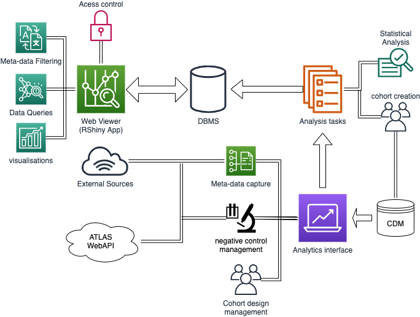

# REWARD-B Project

## System specifications

The system can be divided into three distinct components:

* Analysis generation tool
* Database storage engine
* Web reporting tool

This is captured in the following diagram:

### Analysis generation
The analysis generation tool breaks the steps of the analysis in to a task based workflow.
Interaction for this system will be a command line interface built around a programmatic
API. 

The design of this tool is as follows:
* The full analysis is computed in R and can be ran on any system with access to the CDM
* Each individual task is considered to be atomic, that is to say that it is possible to run each step of the analysis
for each target-outcome cohort individually for each database. There are chains of dependencies, but the application
will verify that the previous step has been completed (e.g. the cohorts must have been created for a data source before
the SCCS step can be run).
* We introduce the concept of a REWARD-B study that seeks to relate groups of outcome and target cohorts.
* This is a subset of the entire results set, and a the RShiny app will be configured to point at these specific study
designs in the database.

This steps include:
* Building necessary results tables, where not present
* Adding cohort class definitions to the REWARD-B system
    * Labelling vocabulary concepts to cohorts

* Adding additional meta-data sources to the system
    * Linking meta-data tags to cohorts and target/outcome pairs
    
* Creating studies for user defined outcome and target concept groupings, for example:
    * A study that looks for potential benefits of TNF-inhibitors on all outcomes
    * A study that looks at the effect of all drugs on disease concepts depression and bipolar disorder
    * A study that looks at all drugs under the ATC codes x, y, z, ... and relates them to all conditions.
   
There will be no explicit limit to the sizes of concepts of diseases or drugs, but the user must specify either a subset of
drug/ingredient or disease concepts. It is likely that many of these results will be pre-computed.

* Performing a statistical analyses on the cohorts:
    * Generating cohorts for specific databases for targets and outcomes
    * Running the SCC and SCC study designs to generate Incident Rate Ratios (IRR)
    * Computing calibrated P-values and Confidence Intervals (CIs) using the 
    EmpiricalCalibration R package from the OHDSI HADES library
    * Storing computed results in the REWARD-B results database 
    

### Database storage engine
The database storage engine is a relational database implementation (Currently a postgres instance) 
that stores the large data sets generated by the all by all analysis performed.

### Web reporting tool
The web reporting tool is an RShiny application that displays the results of the analysis stored in the storage database.
The user will select from the pre-designed studies that the use
